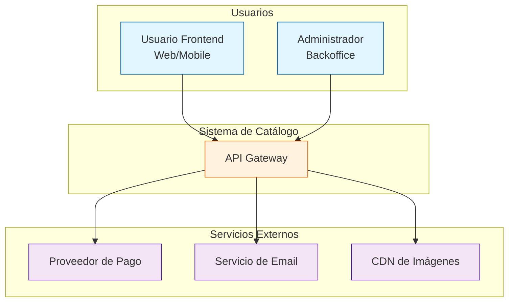
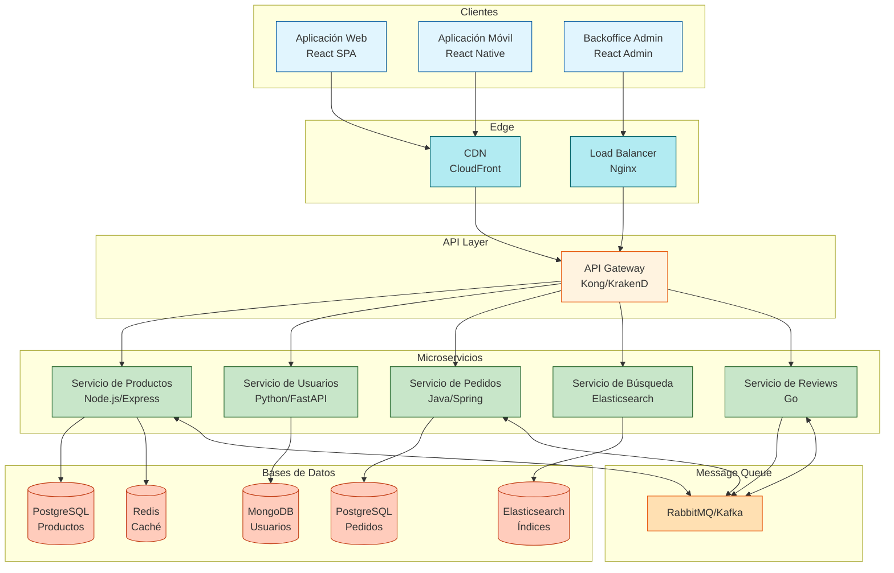
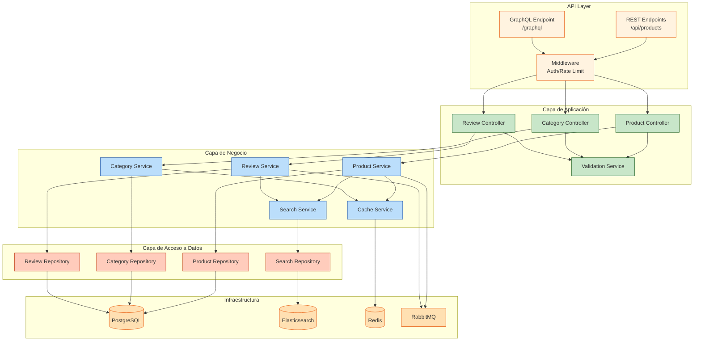
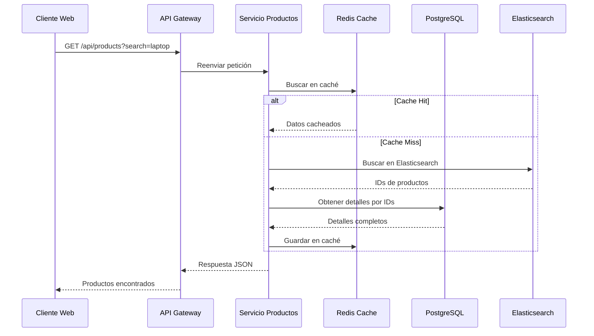
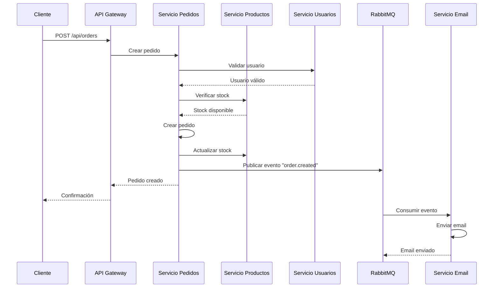
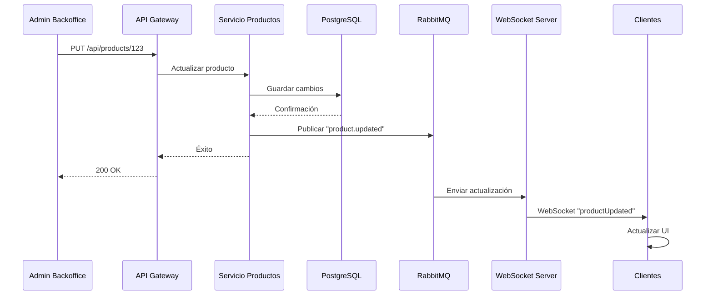

# Arquitectura del Sistema - Catálogo de Productos

## Visión General
Este documento describe la arquitectura del sistema de catálogo de productos, mostrando la interacción entre servicios, bases de datos y clientes. Se utiliza una arquitectura basada en microservicios con API Gateway para manejar las peticiones de los clientes.

## Patrones Arquitectónicos Utilizados
- **Microservicios**: Separación por dominios de negocio
- **API Gateway**: Punto único de entrada para clientes
- **CQRS**: Separación de lecturas y escrituras (donde aplica)
- **Event-Driven**: Comunicación asíncrona entre servicios
- **Database per Service**: Base de datos independiente por servicio

## Diagrama de Contexto del Sistema



### Leyenda - Diagrama de Contexto
| Color | Tipo | Descripción |
|-------|------|-------------|
| 🔵 Azul | Usuarios | Actores que interactúan con el sistema |
| 🟠 Naranja | Sistema | Nuestro sistema principal |
| 🟣 Púrpura | Externos | Servicios de terceros |

## Diagrama de Contenedores



### Leyenda - Diagrama de Contenedores
| Color | Tipo | Descripción |
|-------|------|-------------|
| 🔵 Azul | Clientes | Aplicaciones que consumen la API |
| 🔷 Celeste | Edge | Capa de borde (CDN, Load Balancer) |
| 🟠 Naranja | API Layer | Punto de entrada único |
| 🟢 Verde | Microservicios | Servicios core del negocio |
| 🟤 Café | Bases de Datos | Almacenamiento persistente |
| 🟡 Amarillo | Message Queue | Comunicación asíncrona |

## Diagrama de Componentes Internos (Servicio de Productos)



## Especificación de Tecnologías Propuestas

### Frontend
| Componente | Tecnología | Versión | Justificación |
|------------|------------|---------|---------------|
| Web App | React | 18.x | Amplia comunidad, componentes reutilizables |
| Mobile App | React Native | 0.72 | Código compartido con web |
| Backoffice | React Admin | 4.x | Rápido desarrollo de paneles administrativos |
| State Management | Redux Toolkit | 2.x | Manejo predecible del estado |
| UI Framework | Material-UI | 5.x | Componentes accesibles y personalizables |

### Backend
| Componente | Tecnología | Versión | Justificación |
|------------|------------|---------|---------------|
| API Gateway | KrakenD/Kong | 2.x | Alto rendimiento, fácil configuración |
| Servicio Productos | Node.js/Express | 20.x | Rapidez de desarrollo, async/await |
| Servicio Usuarios | Python/FastAPI | 0.100 | Tipado fuerte, documentación automática |
| Servicio Pedidos | Java/Spring Boot | 3.x | Robustez para transacciones complejas |
| Servicio Búsqueda | Elasticsearch | 8.x | Búsquedas avanzadas y rápidas |
| Servicio Reviews | Go | 1.21 | Alto rendimiento para alta concurrencia |

### Bases de Datos
| Componente | Tecnología | Versión | Justificación |
|------------|------------|---------|---------------|
| Productos | PostgreSQL | 15.x | Integridad referencial, JSONB support |
| Usuarios | MongoDB | 7.x | Flexibilidad de esquemas |
| Pedidos | PostgreSQL | 15.x | ACID compliance |
| Búsqueda | Elasticsearch | 8.x | Búsqueda de texto completo |
| Caché | Redis | 7.x | Alta velocidad, soporte de estructuras |

### Infraestructura
| Componente | Tecnología | Versión | Justificación |
|------------|------------|---------|---------------|
| Contenedores | Docker | 24.x | Portabilidad, consistencia |
| Orquestación | Kubernetes | 1.28 | Auto-escalado, auto-curación |
| Message Queue | RabbitMQ | 3.12 | Comunicación asíncrona confiable |
| CDN | CloudFront | - | Distribución global de contenido |
| Load Balancer | Nginx | 1.24 | Balanceo de carga, SSL termination |

## Flujo de Datos entre Componentes

### Flujo de Consulta de Productos


### Flujo de Creación de Pedido


### Flujo de Actualización en Tiempo Real


## Consideraciones de Arquitectura

### Escalabilidad
- **Horizontal**: Cada microservicio puede escalar independientemente
- **Vertical**: Optimización de recursos por servicio
- **Auto-scaling**: Basado en métricas de CPU/memoria y colas

### Seguridad
- **API Gateway**: Rate limiting, IP whitelisting
- **Autenticación**: JWT con OAuth2
- **Autorización**: RBAC por servicio
- **HTTPS**: TLS 1.3 en todas las comunicaciones
- **Secretos**: HashiCorp Vault o Kubernetes Secrets

### Disponibilidad
- **Alta disponibilidad**: Mínimo 3 réplicas por servicio crítico
- **Multi-AZ**: Distribución en múltiples zonas de disponibilidad
- **Circuit Breaker**: Prevención de fallos en cascada
- **Retry Policies**: Reintentos con backoff exponencial

### Observabilidad
- **Logs**: ELK Stack o Loki
- **Métricas**: Prometheus + Grafana
- **Tracing**: Jaeger o Zipkin
- **Alertas**: AlertManager + PagerDuty

## Estructura de Archivos Propuesta

```
docs/
└── architecture/
    └── diagram.md           # Este archivo

infrastructure/
├── kubernetes/
│   ├── namespaces.yaml
│   ├── deployments/
│   └── services/
├── docker/
│   ├── product-service/
│   ├── user-service/
│   └── order-service/
└── terraform/
    ├── main.tf
    ├── variables.tf
    └── outputs.tf
```

## Próximos Pasos
1. ✅ Definir arquitectura de componentes
2. ⬜ Configurar repositorios de microservicios
3. ⬜ Implementar API Gateway
4. ⬜ Configurar bases de datos
5. ⬜ Establecer pipelines CI/CD
6. ⬜ Implementar monitoreo y alertas

---
**Última actualización:** Febrero 2026  
**Versión:** 1.0.0  
**Autores:** Equipo de Arquitectura